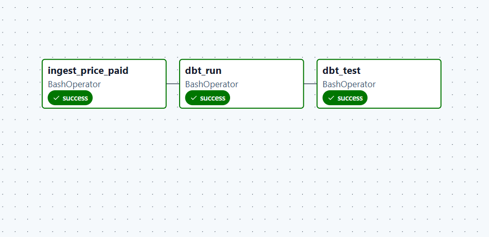
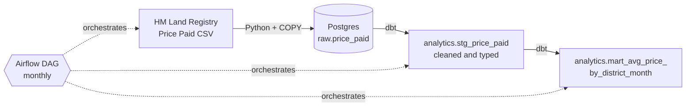

# UK Housing Data Pipeline


An end-to-end data pipeline that loads HM Land Registry **Price Paid Data** into PostgreSQL, transforms it with **dbt**, tests it, and orchestrates the whole thing with **Apache Airflow**. It runs locally in Docker, and **GitHub Actions** checks every push.

I built this as a personal project to get hands-on with the tools used in modern data engineering teams: orchestration, layered modelling, automated data testing, containers and CI/CD.

<!-- Add a screenshot of a successful Airflow run at docs/airflow_run.png, then uncomment the next line:

-->

## Architecture



| Layer | What it holds |
|---|---|
| **raw** | The source data exactly as received (all text columns), plus the source file name and load time |
| **staging** | One cleaned model: types cast, column names standardised, single-letter codes decoded into readable labels |
| **mart** | Sales count, average price and median price by district, month and property type |

## Tech stack

- **Python** (psycopg) for ingestion
- **PostgreSQL 16** as the warehouse
- **dbt** (dbt-postgres) for transformations and data tests
- **Apache Airflow 3** for orchestration
- **Docker / Docker Compose** for the local environment
- **GitHub Actions** for CI (lint, dbt run, dbt test)
- Developed on Windows with WSL2 (Ubuntu)

## Data source

[HM Land Registry Price Paid Data](https://www.gov.uk/government/statistical-data-sets/price-paid-data-downloads): every residential property sale in England and Wales. The 2025 file contains about 974,000 transactions.

Contains HM Land Registry data © Crown copyright and database right 2026. This data is licensed under the [Open Government Licence v3.0](https://www.nationalarchives.gov.uk/doc/open-government-licence/version/3/).

## Project structure

```
.
├── ingest/
│   ├── load_price_paid.py      # downloads a yearly file and loads it into raw.price_paid
│   └── requirements.txt
├── dbt/
│   ├── dbt_project.yml
│   ├── profiles.yml            # reads credentials from environment variables
│   └── models/
│       ├── staging/            # stg_price_paid + tests
│       └── marts/              # mart_avg_price_by_district_month + tests
├── airflow/
│   ├── Dockerfile              # Airflow image with dbt in a separate virtualenv
│   └── dags/
│       └── uk_housing_pipeline.py
├── ci/
│   └── seed_raw.sql            # small fixture dataset used by CI
├── .github/workflows/ci.yml
├── docker-compose.yml
└── .env.example
```

## Data quality tests

Seven dbt tests run on every pipeline run and every CI run:

- `transaction_id` is not null and unique
- `price` and `sale_date` are not null
- `property_type` only contains expected values
- `sale_month` and `sales_count` in the mart are not null

## Orchestration

The Airflow DAG `uk_housing_pipeline` runs three tasks in order:

1. `ingest_price_paid`: download (if needed) and load the yearly file into `raw.price_paid`
2. `dbt_run`: build the staging and mart models
3. `dbt_test`: run the data tests

It is scheduled monthly, each task retries twice (five minutes apart), and the year to load is a DAG parameter (default `2025`). Because the tasks run in sequence, dbt never builds on top of a failed load.

## Getting started

**Prerequisites:** Docker Desktop (with WSL2 on Windows), Git and Python 3.

```bash
# 1. Clone and configure
git clone https://github.com/sayo-t/uk-housing-pipeline.git
cd uk-housing-pipeline
cp .env.example .env            # then set your own password in .env

# 2. Start Postgres
docker compose up -d postgres

# 3. Set up Python
python3 -m venv .venv
source .venv/bin/activate
pip install -r ingest/requirements.txt dbt-postgres

# 4. Load the data (downloads about 130 MB)
python ingest/load_price_paid.py 2025

# 5. Transform and test
set -a; source .env; set +a
cd dbt
dbt run --profiles-dir .
dbt test --profiles-dir .
```

### Run it with Airflow

```bash
echo "AIRFLOW_UID=$(id -u)" >> .env
docker compose exec postgres psql -U housing -d housing -c "CREATE DATABASE airflow;"
docker compose build airflow
docker compose up -d airflow
```

Open http://localhost:8080, switch on `uk_housing_pipeline` and trigger a run. Airflow needs roughly 2 GB of RAM, so stop it when you are not using it: `docker compose stop airflow`.

### Example query

```sql
SELECT district, sale_month, property_type, sales_count, avg_price, median_price
FROM analytics.mart_avg_price_by_district_month
WHERE district = 'LEEDS'
ORDER BY sale_month, property_type;
```

## Design decisions

- **Raw layer stored as text.** The source files have no header row and some columns are messy. Keeping the raw layer untouched means a bad cast cannot lose data, and all type conversion happens in dbt where it is tested.
- **Repeatable loads.** The ingest script loads into a temporary table, deletes any rows from the same source file, then inserts. Re-running it never duplicates data.
- **Standard sales only in the mart.** The mart filters to Price Paid category A (standard residential sales) so averages are not distorted by repossessions or transfers.
- **dbt in its own virtualenv inside the Airflow image.** This avoids dependency conflicts between dbt and Airflow.
- **CI uses a small fixture, not the real data.** The real file is too large for fast CI, so the workflow seeds a few rows with `ci/seed_raw.sql` and checks that the models build and the tests pass.
- **Airflow in standalone mode.** This keeps the local setup light enough for a laptop. A production deployment would run the Airflow components as separate services.
- **Credentials from environment variables.** Nothing sensitive is committed; `.env` is git-ignored and `.env.example` shows the expected variables.

## Limitations and next steps

- Loads one full yearly file at a time, rather than incrementally applying the monthly update files (which include changed and deleted records)
- Failure alerts (email or Slack) are not set up yet
- Move the warehouse from local Postgres to Snowflake, with raw files stored in AWS S3
- Add incremental dbt models and a dashboard on top of the mart
